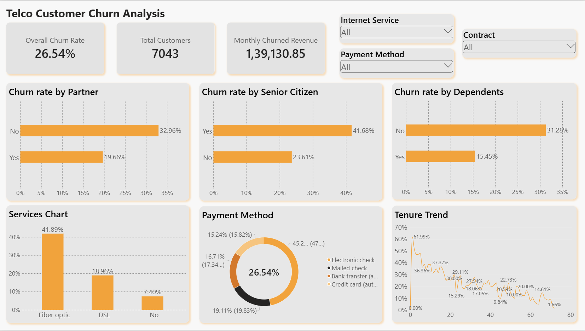
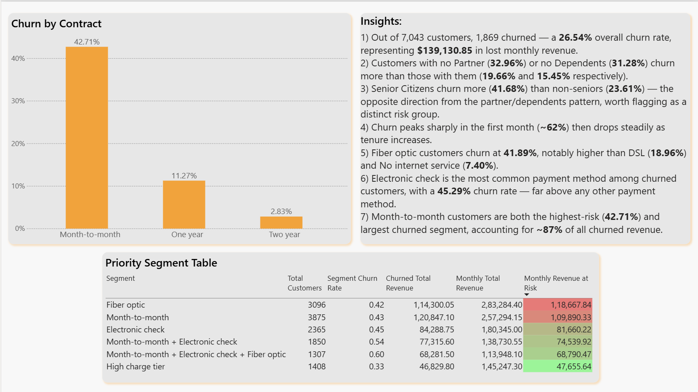

# Telco Customer Churn Analysis

End-to-end churn analysis for a telecom company, identifying which customers are most likely to leave, how much revenue is at risk, and where retention efforts should be prioritized.

**Pipeline:** Python (pandas) → PostgreSQL → Power BI

---

## Business Question

Which customer segments are driving churn, and where should the business focus retention efforts to protect the most revenue?

## Dataset

[IBM Telco Customer Churn dataset](https://www.kaggle.com/datasets/blastchar/telco-customer-churn) — 7,043 customers, 21 features covering demographics, account information, and subscribed services.

## Tools

- **Python (pandas, NumPy)** — data cleaning, feature engineering, exploratory analysis
- **PostgreSQL** — storage layer for the cleaned dataset and derived tables
- **Power BI** — interactive dashboard

## How to Run

1. Clone the repo and install dependencies: `pip install -r requirements.txt`
2. Run `telco_churn_analysis.py` — this cleans the raw data, engineers features, runs the full analysis, and generates the priority segment table
3. (Optional) Run the Postgres load step to push the cleaned data into a local database for the Power BI dashboard to connect to

## Key Findings

- **Overall churn rate: 26.54%** (1,869 of 7,043 customers), representing **$139,130.85** in lost monthly revenue
- **Contract type is the strongest single predictor of churn.** Month-to-month customers churn at 42.71%, vs. 11.27% for one-year and 2.83% for two-year contracts — and since month-to-month is also the largest segment (~55% of customers), it accounts for ~87% of all churned revenue
- **Household ties reduce churn** — customers with a partner or dependents churn less — while **senior citizens churn more** (41.68% vs. 23.61%), an opposite pattern worth investigating separately
- **Churn is heaviest in the first month** (~62%) and drops steadily as tenure increases
- **Fiber optic and Electronic check** are both individually associated with higher churn (41.89% and 45.29% respectively)
- **Risk factors compound.** Month-to-month alone churns at 42.71%. Adding Electronic check billing raises that to 53.73%. Adding Fiber optic on top pushes it to **60.37%** — more than double the baseline rate. This is the project's standout finding: churn risk isn't just additive across factors, it stacks.
- **Revenue-weighted prioritization:** ranking customer segments by `churn_rate × monthly revenue exposure` (rather than churn rate alone) shows Fiber optic as the top priority — not because it has the worst churn rate, but because its size means the most total dollars are at risk. The triple-risk segment above has the highest churn rate in the dataset but ranks lower on dollar impact due to its smaller size, flagging it as a distinct high-risk profile worth targeted retention outreach.

## Dashboard

Two-page interactive Power BI dashboard:
- **Page 1 — Churn Drivers Overview:** KPIs, demographic and service-based churn breakdowns, tenure trend
- **Page 2 — Revenue Impact & Priority:** contract-type churn, and a revenue-weighted priority segment table with conditional formatting

*(Open `Telco_Churn_BI.pbix` in Power BI Desktop for the interactive version.)*
